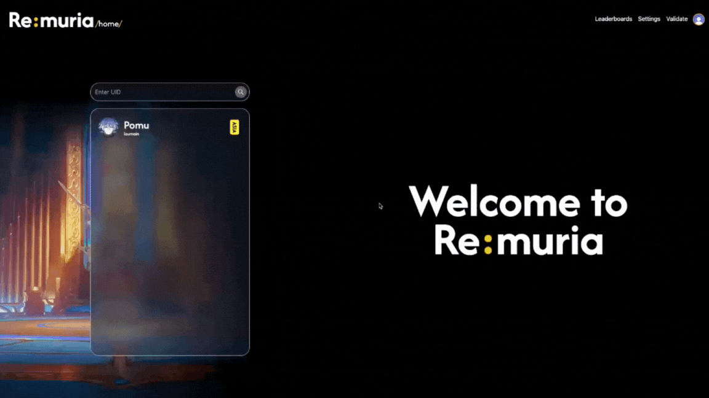
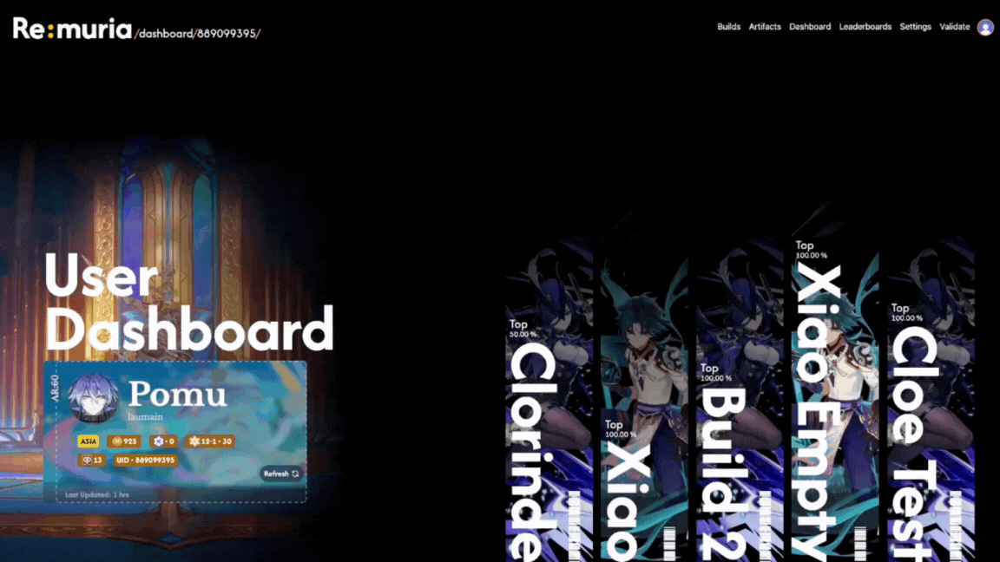
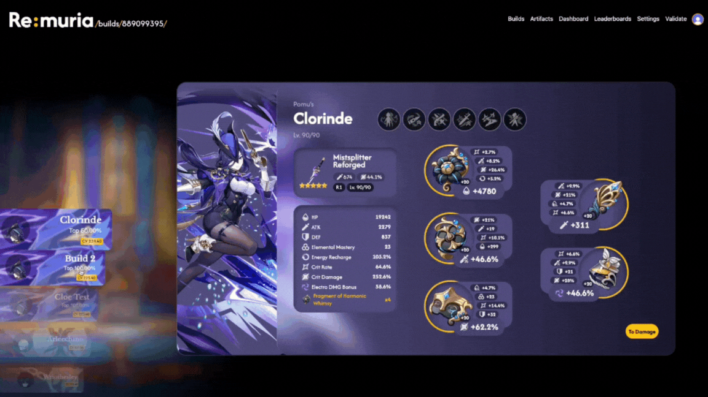
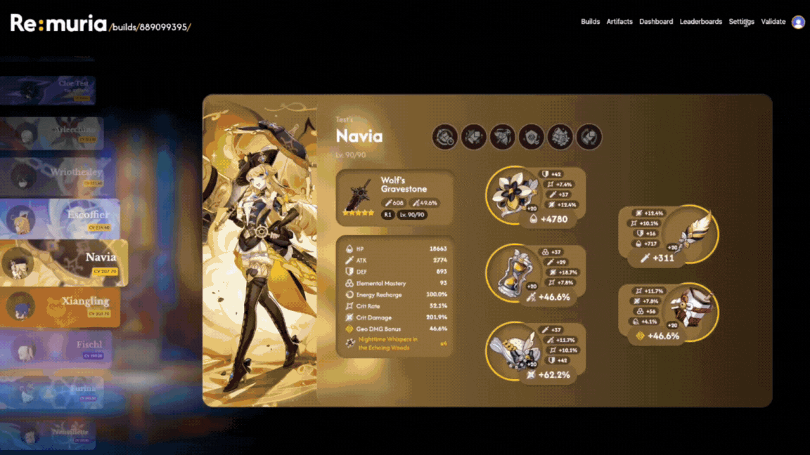
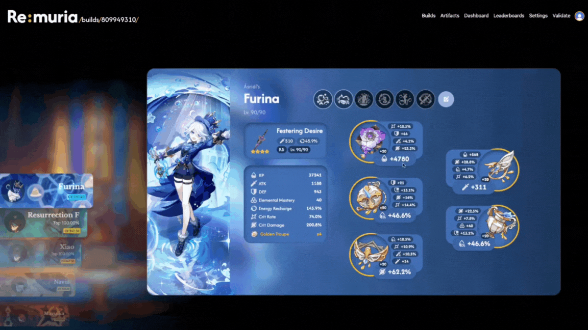
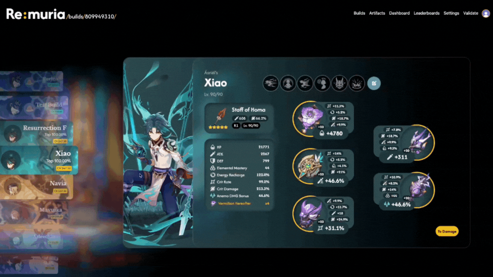
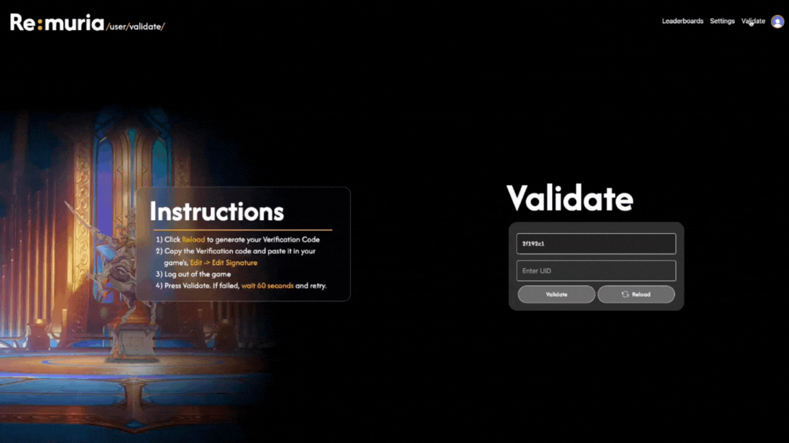

# Re:muria — Genshin Impact

The frontend for our first full-stack web application prototype built for **Genshin Impact** players to view detailed user stats, artifacts,character builds, rankings and damage calculations — powered by the [Enka.Network API](https://api.enka.network/#/).

> ⚙️ *Finished Prototype, not being updated due to an entirely new version of it in work*

---

## ✨ Demo Previews

<table align="center">
<tr>
<td align="center">
  
   
  <b>Homepage & UID Search</b>
</td>
</tr>
<tr>
<td align="center">
  
   
  <b>User Dashboard</b>
</td>
</tr>
<tr>
<td align="center">
  
   
  <b>Character Builds Display</b>
</td>
</tr>
<tr>
<td align="center">
  
   
  <b>Builds card with Card Animations</b>
</td>
</tr>
<tr>
<td align="center">
  
   
  <b>Editing and Saving Builds</b>
</td>
</tr>
<tr>
<td align="center">
  
   
  <b>Builds damage Visualized</b>
</td>
</tr>
<tr>
<td align="center">
  
   
  <b>in-game profile validation page</b>
</td>
</tr>
</table>

---

## 🧩 Tech Stack

| Layer | Technologies Used                               |
|:------|:------------------------------------------------|
| **Frontend** | ReactJS, TailwindCSS, Framer Motion             |
| **Backend** | Java Spring Boot, Swagger UI                    |
| **Database** | MongoDB                                         |
| **API Source** | [Enka.Network API](https://api.enka.network/#/) |
| **Architecture** | MVC (Model-View-Controller)                     |

---

## 🌠 Features (Planned & Implemented)

### ✅ Implemented
- UID-based player search
- Dynamic dashboard displaying user stats and artifacts
- Visualizes Character Damage over rotation (only Select characters)
- Glassy-style Character build cards
- Real-time data fetch from Enka API
- User login and personalized dashboards
- Character Builds Ranking System segregated via Energy Regeneration splits
- Optional Card Animations can enabled to give a better design experience with the Character Builds card

